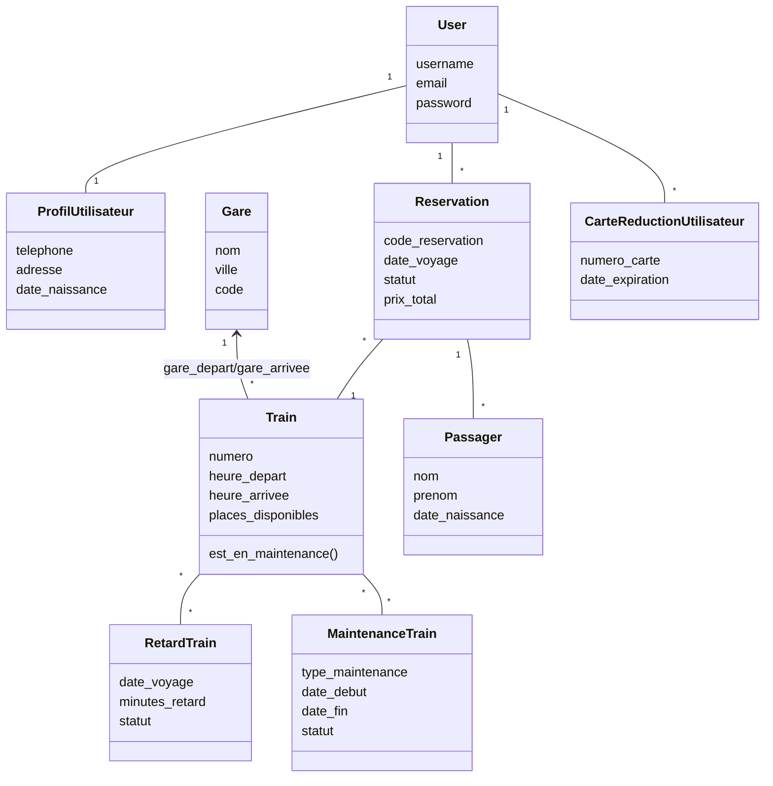
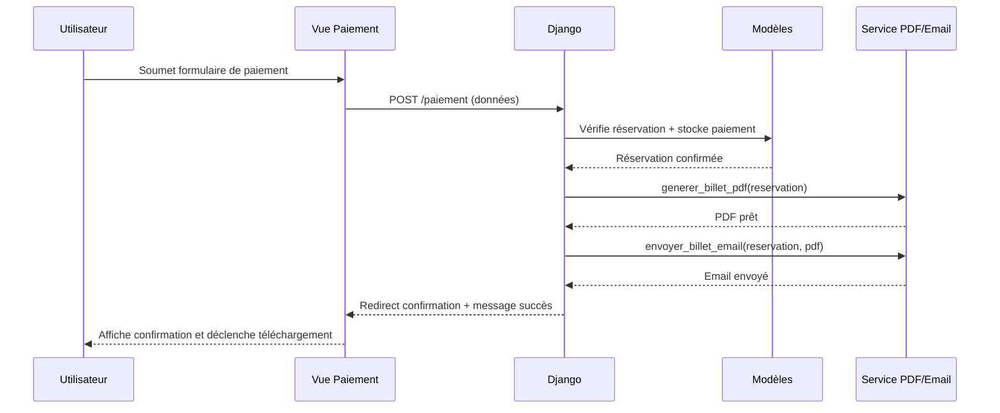

# Diagrammes UML - AGCF Voyages

## Diagramme de cas d'utilisation
```mermaid
%% Diagramme des principaux acteurs
usecaseDiagram
  actor Voyageur
  actor Operateur as "Opérateur AGCF"
  actor SystemePaiement as "Système de paiement"

  Voyageur --> (Rechercher un trajet)
  Voyageur --> (Réserver un billet)
  Voyageur --> (Payer et recevoir le billet)
  Voyageur --> (Gérer réservation)
  Voyageur --> (Consulter retards)

  Operateur --> (Planifier maintenance)
  Operateur --> (Signaler un retard)
  Operateur --> (Superviser tableaux de bord)

  (Réserver un billet) --> (Payer et recevoir le billet)
  (Payer et recevoir le billet) --> SystemePaiement
  (Gérer réservation) --> (Changer d'horaire)
  (Gérer réservation) --> (Annuler réservation)
  (Consulter retards) <-- (Signaler un retard)
```

## Diagramme de classes (simplifié)


## Diagramme de séquence – Paiement et génération du billet


> Ces diagrammes peuvent être visualisés avec n'importe quel moteur Mermaid (GitHub, VS Code, etc.).

